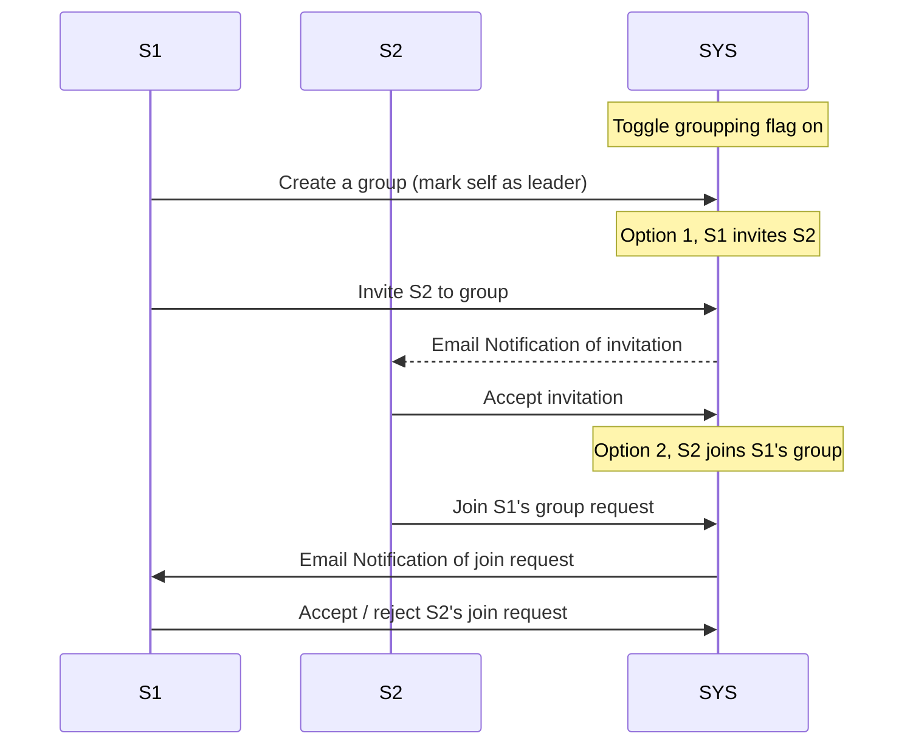

# Grouping

This section describes how the grouping API implementation.



We can use JWT token included in the Email / notification to verify the user identity.

## List users (with pager)

GET /users

```jsonc
{
  "page": 1,
  "page_size": 20,
  "users": [
    {
      "student_id": "2022010001",
      "name": "User1",
      "group": "unique_code_name", // null if not in any group
    }, // , ...
  ],
}
```

## List groups (with pager)

GET /groups

```jsonc
{
  "page": 1,
  "page_size": 20,
  "groups": [
    {
      "name": "group_name",
      "code_name": "unique_code_name",
      "leader": {
        "student_id": "student_id_of_leader",
        "name": "name_of_leader",
      },
      "members": [
        {
          "student_id": "student_id_of_member",
          "name": "name_of_member",
        },
      ],
    }, // , ...
  ],
}
```

## Create group

POST /group/create

```jsonc
{
  "name": "group_name", // This is the display name
  "code_name": "unique_code_name", // This is the unique identifier, should conform to GitLab group name rules
}
```

## Invite user

POST /group/invite

Invite a user to join your group, the invitee can accept the invitation to join; or can reject. Backend should allow at most 5 pending invitations per user.

```jsonc
{
  "group_code_name": "unique_code_name",
  "invitee_student_id": "2022010002",
}
```

## Accept invitation

POST /group/invite/accept

Ideally, a notification should be sent to the inviter to inform them that the invitee has accepted the invitation.

```jsonc
{
  "token": "token_in_email_notification_or_in_web_notification",
}
```

## Reject invitation

POST /group/invite/reject

```jsonc
{
  "token": "token_in_email_notification_or_in_web_notification",
}
```

## Join group

POST /group/join

Request to join a group, the group leader can accept or reject the request. Backend should allow at most 5 pending requests per user.

```jsonc
{
  "group_code_name": "unique_code_name",
}
```

## Accept join request

POST /group/join/accept

```jsonc
{
  "token": "token_in_email_notification_or_in_web_notification",
}
```

## Reject join request

POST /group/join/reject

```jsonc
{
  "token": "token_in_email_notification_or_in_web_notification",
}
```

---

Now we assume that students have chosen their groups, we should allow the TA to assign ungrouped students to groups. This also should trigger a notification.

## Assign user to group (admin only)

POST /admin/group_assign

```jsonc
{
  "group_code_name": "unique_code_name",
  "student_id": "2022010002",
}
```
